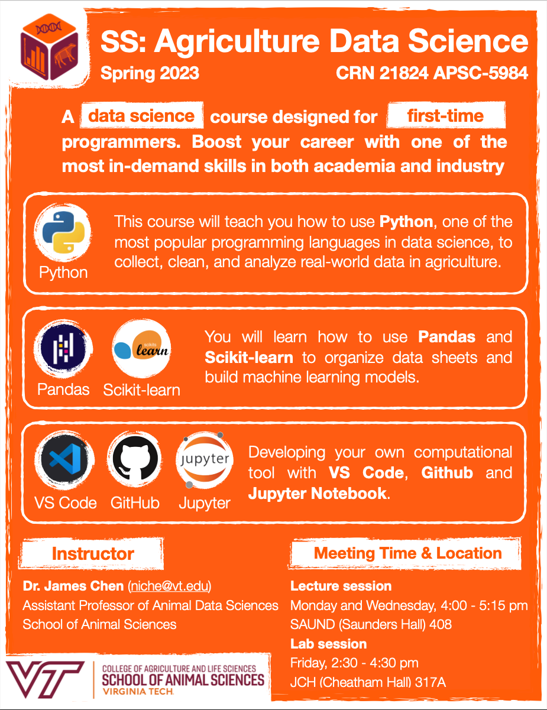

# APSC-5984 SS: Agriculture Data Science

## Course Logistics

**Instructor**: [James Chen](https://github.com/poissonfish) (<niche@vt.edu>)

**Term**: Spring 2023

**Meeting time and location**:

* Lecture: Monday and Wednesday 4:00 - 5:15 pm, SAUND (Saunders Hall) 408
* Lab: Friday 2:30 - 4:30 pm, JCH (Cheatham Hall) 317A

## Course Description

An unprecedentedly significant amount of data is produced in the modern agriculture industry every day. As a discipline to organize, analyze and visualize large data sets, data science has become essential knowledge for agriculture students. The course will cover many important topics in data science, including data preprocessing, database construction, supervised and unsupervised learning models, data visualization, and web app development. Students will work with real agriculture production data and implement each core topic using the programming language, Python. This course also requires students to attend the laboratory section, where further hands-on experience in data analysis can be obtained. The students will have a chance to establish a programming environment and derive a Python script to solve real-world problems using example datasets.

## Course Prerequisties

Students should have a basic understanding of analyzing research data with Microsoft Excel.  Familiarity with Python would be very helpful in this class. However, students are assumed to have no background in any programming language.

## Course Objectives

After completing the course, the students are anticipated to

* Be capable of performing data analysis on a large scale (> 10,000 records).
* Use programming language to help understand their research data.
* Be able to develop a computation tool to answer a scientific question on their own.

## Lab

The lab section will take place every Friday afternoon.  Students will work with their peers and the instructor to solve real-world problems using the programming language, Python.  Each lab session will have a specific topic, which will be covered in the lecture section.  Students are expected to complete the lab assignment before the end of next Monday.
The lab assignment will be posted in the repository at least one week before the lab session. The lab assignments will be graded based on the rubric described in the beginning of each assignment.

## Textbooks

* Daumé, H. A Course in Machine Learning. 2017 (<http://ciml.info/>)
* Goodfellow, I., Y. Bengio, and A. Courville. 2016. Deep Learning. MIT Press. 2016. (<https://www.deeplearningbook.org/lecture_slides.html>)
* McKinney, W. Python for Data Analysis: Data Wrangling with pandas, NumPy, and Jupyter, 3rd edition. O’Reilly Media. 2022. (<https://wesmckinney.com/book/>)
* Szeliski, R. Computer Vision: Algorithms and Applications, 2nd edition. Springer. 2022. (<https://szeliski.org/Book/>)

## Academic Integrity

All students are expected to maintain the highest standards of academic integrity.  Cheating, plagiarism or any other form of academic dishonesty will not be tolerated. If a student is found to be cheating, the student will receive a grade of 0 for the assignment.

## Schedule

| Week | Lecture 1 | Lecture 2 | Lab |
| :--- | :-------- | :-------- | :---|
| 1 | [No class]   Martin Luther King Jr. Day | What is Data Science? | Environment setup |
| 2 | Coding environment | Python basics | Python basics I |
| 3 | List, index | if-else, for-loop | Python basics II |
| 4 | File system | String processing | Python basics III |
| 5 | Data frames | Data frames | Pandas library |
| 6 | [No class]   Presidents' Day | Intro to database | Public datasets |
| 7 | SQL basics | SQLite 3 | SQLite 3 |
| 8 | [No class]   Spring break | [No class]   Spring break | [No class]   Spring break |
| 9 | Regression model | Regularization | Scikit-learn |
| 10 | Feature selection | Model validation | Feature selection |
| 11 | Principal Component Analysis | K-means clustering | PCA and K-means |
| 12 | Intro to computer vision | Convolution | OpenCV |
| 13 | Data visualization | Web app | Plotly |
| 14 | Object-oriented programming | Encapsulation | OOP implementation I |
| 15 | Object and Class | Inheritance and polymorphsm | OOP implementation II |
| 16 | Project presentation | Project presentation | Lab final exam |
